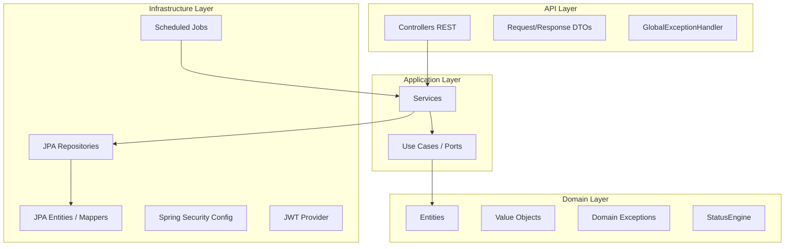
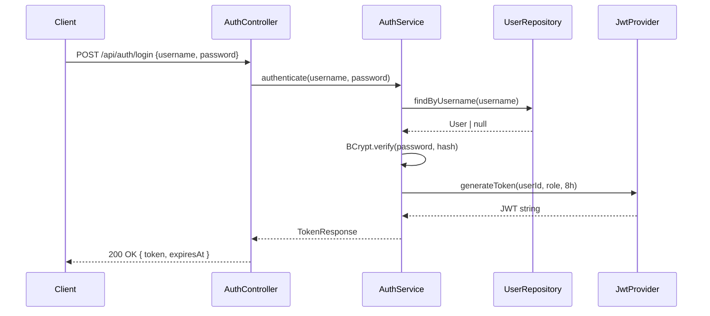
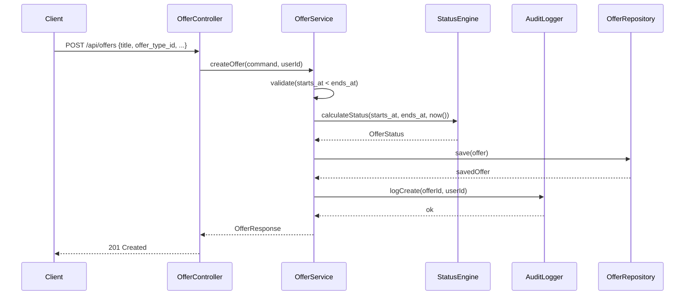
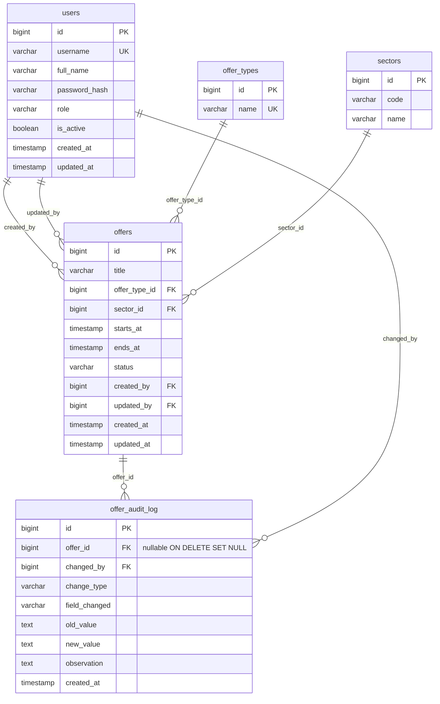

# Diseño Técnico: Plataforma de Gestión de Ofertas Comerciales Easy

## Overview

El sistema es una plataforma web centralizada que reemplaza el flujo manual basado en Excel para gestionar ofertas comerciales. Está compuesto por un backend REST en Java 21 + Spring Boot, un frontend en Angular, y una base de datos PostgreSQL, todo orquestado con Docker Compose.

El backend sigue **Clean Architecture** con cuatro capas bien delimitadas:

```
API (Controllers)  →  Application (Services)  →  Domain (Entities)  →  Infrastructure (Persistence)
```

La regla de dependencia es estricta: las capas externas dependen de las internas, nunca al revés. El dominio no conoce Spring ni JPA.

### Decisiones de diseño clave

- **Monolito modular**: un único artefacto desplegable dividido en paquetes por módulo funcional (`auth`, `users`, `offers`, `audit`). Esto simplifica el despliegue inicial sin sacrificar la separabilidad futura.
- **JWT stateless**: no hay sesiones en servidor. Cada request lleva el token; el backend lo valida y extrae el rol. Esto escala horizontalmente sin estado compartido.
- **Status calculado, no almacenado como campo libre**: el estado de una oferta (`PROXIMA`, `ACTIVA`, `VENCIDA`) se deriva de las fechas y la hora UTC del servidor. Se persiste para eficiencia de consultas pero siempre puede recalcularse.
- **Auditoría inmutable**: los registros de `offer_audit_log` nunca se modifican ni eliminan, incluso si la oferta es borrada. Se usa `ON DELETE SET NULL` en la FK hacia `offers`.

---

## Architecture

### Diagrama de capas



### Diagrama de flujo de autenticación



### Diagrama de flujo de creación de oferta



---

## Components and Interfaces

### Módulo `auth`

**Responsabilidad**: autenticación y emisión de JWT.

```
auth/
  api/
    AuthController.java          # POST /api/auth/login
  application/
    AuthService.java             # lógica de autenticación
  infrastructure/
    JwtProvider.java             # firma y validación de tokens
    JwtAuthFilter.java           # OncePerRequestFilter
    SecurityConfig.java          # configuración Spring Security
```

**Interfaces clave:**

```java
// Puerto de dominio (no depende de Spring)
public interface TokenProvider {
    String generateToken(Long userId, String role, Duration validity);
    TokenClaims validateToken(String token);
}

public record TokenClaims(Long userId, String role, Instant expiresAt) {}
```

**Por qué un puerto**: el dominio/aplicación no debe importar `io.jsonwebtoken`. Si mañana cambiamos la librería JWT, solo cambia la implementación en Infrastructure.

---

### Módulo `users`

**Responsabilidad**: CRUD de usuarios, solo accesible por ADMIN.

```
users/
  api/
    UserController.java          # POST /api/users, PATCH /api/users/{id}/deactivate
  application/
    UserService.java
  domain/
    User.java                    # entidad de dominio (sin anotaciones JPA)
    UserRole.java                # enum: ADMIN, EMPLOYEE
  infrastructure/
    UserJpaEntity.java           # @Entity con anotaciones JPA
    UserJpaRepository.java       # extends JpaRepository
    UserMapper.java              # UserJpaEntity <-> User
```

---

### Módulo `offers`

**Responsabilidad**: CRUD de ofertas, filtrado, paginación.

```
offers/
  api/
    OfferController.java         # GET/POST/PUT/DELETE /api/offers
    OfferFilterParams.java       # record con parámetros de query
  application/
    OfferService.java
    CreateOfferCommand.java      # record inmutable con datos de entrada
    UpdateOfferCommand.java
  domain/
    Offer.java                   # entidad de dominio
    OfferStatus.java             # enum: PROXIMA, ACTIVA, VENCIDA
    OfferType.java               # entidad de dominio
    Sector.java                  # entidad de dominio
    StatusEngine.java            # lógica pura de cálculo de estado
  infrastructure/
    OfferJpaEntity.java
    OfferJpaRepository.java      # con @Query para filtros dinámicos
    OfferMapper.java
    StatusUpdateJob.java         # @Scheduled cada 1 hora
    CleanupJob.java              # @Scheduled diario
```

**StatusEngine** es una clase de dominio puro (sin dependencias externas):

```java
public class StatusEngine {
    public static OfferStatus calculate(LocalDateTime startsAt, LocalDateTime endsAt, Instant now) {
        LocalDateTime nowUtc = LocalDateTime.ofInstant(now, ZoneOffset.UTC);
        if (nowUtc.isBefore(startsAt)) return OfferStatus.PROXIMA;
        if (!nowUtc.isAfter(endsAt))   return OfferStatus.ACTIVA;
        return OfferStatus.VENCIDA;
    }
}
```

**Por qué dominio puro**: esta lógica es el corazón del negocio. Al no depender de Spring ni de la hora del sistema directamente (recibe `Instant now` como parámetro), es trivialmente testeable con cualquier fecha arbitraria.

---

### Módulo `audit`

**Responsabilidad**: registro inmutable de eventos sobre ofertas.

```
audit/
  api/
    AuditController.java         # GET /api/offers/{id}/audit
  application/
    AuditLogger.java             # interfaz puerto
    AuditService.java            # implementación
  domain/
    AuditLog.java                # entidad de dominio
    ChangeType.java              # enum: CREATE, UPDATE, DELETE, AUTO_DELETE
  infrastructure/
    AuditLogJpaEntity.java
    AuditLogJpaRepository.java
    AuditMapper.java
```

---

### Dashboard

El dashboard no tiene módulo propio en backend: es un endpoint en `OfferController` que agrega datos:

```
GET /api/dashboard
```

Retorna conteos por estado y las 10 ofertas más recientes por estado `ACTIVA` y `PROXIMA`.

---

## Data Models

### Diagrama entidad-relación



### Índices en tabla `offers`

```sql
CREATE INDEX idx_offers_offer_type_id ON offers(offer_type_id);
CREATE INDEX idx_offers_sector_id     ON offers(sector_id);
CREATE INDEX idx_offers_status        ON offers(status);
CREATE INDEX idx_offers_starts_at     ON offers(starts_at DESC);
```

**Por qué estos índices**: el Requerimiento 6.4 exige respuesta < 500ms para 10.000 registros. Los filtros más frecuentes son por `sector_id`, `offer_type_id` y `status`. El índice en `starts_at DESC` optimiza el ordenamiento por defecto (Req 6.5).

### Datos de referencia (seed)

Las tablas `offer_types` y `sectors` se poblan con datos fijos en el arranque mediante un script SQL de inicialización (`data.sql`). No son editables por la API.

### Entidad de dominio `Offer` (sin JPA)

```java
public record Offer(
    Long id,
    String title,
    Long offerTypeId,
    Long sectorId,
    LocalDateTime startsAt,
    LocalDateTime endsAt,
    OfferStatus status,
    Long createdBy,
    Long updatedBy,
    Instant createdAt,
    Instant updatedAt
) {}
```

**Por qué `record`**: las entidades de dominio son inmutables. Para modificar una oferta se crea una nueva instancia con los campos actualizados. Esto elimina bugs de estado mutable y facilita el razonamiento.

### Entidad JPA `OfferJpaEntity` (en Infrastructure)

```java
@Entity
@Table(name = "offers")
public class OfferJpaEntity {
    @Id @GeneratedValue(strategy = GenerationType.IDENTITY)
    private Long id;

    @Column(nullable = false)
    private String title;

    @Column(name = "offer_type_id", nullable = false)
    private Long offerTypeId;

    @Column(name = "sector_id", nullable = false)
    private Long sectorId;

    @Column(name = "starts_at", nullable = false)
    private LocalDateTime startsAt;

    @Column(name = "ends_at", nullable = false)
    private LocalDateTime endsAt;

    @Enumerated(EnumType.STRING)
    @Column(nullable = false)
    private OfferStatus status;

    @Column(name = "created_by", nullable = false)
    private Long createdBy;

    @Column(name = "updated_by")
    private Long updatedBy;

    @Column(name = "created_at", nullable = false, updatable = false)
    private Instant createdAt;

    @Column(name = "updated_at")
    private Instant updatedAt;
}
```

**Por qué separar entidad de dominio de entidad JPA**: JPA requiere constructores vacíos, setters y anotaciones que contaminan el modelo de negocio. El mapper convierte entre ambas representaciones en la capa Infrastructure.

### Respuestas de API (DTOs)

```java
// Respuesta de oferta
public record OfferResponse(
    Long id, String title, String offerType, String sector,
    LocalDateTime startsAt, LocalDateTime endsAt,
    String status, String createdBy, Instant createdAt
) {}

// Respuesta de auditoría
public record AuditLogResponse(
    Long id, Long offerId, String changedBy, String changeType,
    String fieldChanged, String oldValue, String newValue,
    String observation, Instant createdAt
) {}

// Respuesta de dashboard
public record DashboardResponse(
    long activeCount, long upcomingCount, long expiredCount,
    List<OfferResponse> recentActive,
    List<OfferResponse> recentUpcoming
) {}
```

---


## Correctness Properties

*Una propiedad es una característica o comportamiento que debe mantenerse verdadero en todas las ejecuciones válidas del sistema — esencialmente, una declaración formal sobre lo que el sistema debe hacer. Las propiedades sirven como puente entre las especificaciones legibles por humanos y las garantías de corrección verificables por máquinas.*

---

### Property 1: Autenticación exitosa genera token válido

*Para cualquier* usuario activo del sistema con credenciales correctas, el proceso de autenticación debe retornar un token JWT que contenga el rol correcto del usuario y tenga una vigencia de exactamente 8 horas desde el momento de emisión.

**Validates: Requirements 1.1**

---

### Property 2: Credenciales inválidas siempre son rechazadas

*Para cualquier* combinación de username y password que no corresponda a un usuario activo del sistema, el servicio de autenticación debe retornar HTTP 401.

**Validates: Requirements 1.2**

---

### Property 3: Requests sin token o con token expirado son rechazados

*Para cualquier* endpoint protegido del sistema, una solicitud que llegue sin header `Authorization` o con un JWT cuya fecha de expiración sea anterior al momento actual debe ser rechazada con HTTP 401.

**Validates: Requirements 1.3**

---

### Property 4: Autorización por rol es estricta

*Para cualquier* endpoint que requiera rol ADMIN, una solicitud autenticada con rol EMPLOYEE debe ser rechazada con HTTP 403, independientemente del recurso solicitado.

**Validates: Requirements 1.4, 2.4, 5.3, 9.3**

---

### Property 5: Contraseñas almacenadas con BCrypt factor >= 10

*Para cualquier* contraseña de usuario almacenada en el sistema, el hash persistido debe ser un hash BCrypt válido con factor de costo mayor o igual a 10 (identificable por el prefijo `$2a$10$` o superior).

**Validates: Requirements 1.5**

---

### Property 6: Creación de usuario persiste correctamente

*Para cualquier* conjunto válido de datos de usuario (username único, full_name, password, rol válido), la operación de creación debe persistir el usuario con `is_active = true` y retornar HTTP 201 con el recurso creado.

**Validates: Requirements 2.1**

---

### Property 7: Username duplicado siempre retorna conflicto

*Para cualquier* username que ya exista en el sistema, un intento de crear un nuevo usuario con ese mismo username debe retornar HTTP 409.

**Validates: Requirements 2.2**

---

### Property 8: Usuario desactivado no puede autenticarse

*Para cualquier* usuario cuyo campo `is_active` sea `false`, un intento de autenticación con sus credenciales correctas debe ser rechazado con HTTP 401.

**Validates: Requirements 2.3**

---

### Property 9: Roles inválidos son rechazados en creación de usuario

*Para cualquier* string que no sea exactamente `ADMIN` o `EMPLOYEE`, un intento de crear un usuario con ese valor como rol debe ser rechazado con HTTP 400.

**Validates: Requirements 2.5**

---

### Property 10: Creación de oferta con datos válidos persiste correctamente

*Para cualquier* conjunto válido de datos de oferta (title, offer_type_id existente, sector_id existente, starts_at anterior a ends_at), la operación de creación debe persistir la oferta y retornar HTTP 201 con el recurso creado.

**Validates: Requirements 3.1**

---

### Property 11: Validación de fechas rechaza rangos inválidos

*Para cualquier* par de fechas donde `starts_at >= ends_at`, tanto la creación como la edición de una oferta deben ser rechazadas con HTTP 400.

**Validates: Requirements 3.2, 4.6**

---

### Property 12: StatusEngine calcula estado correcto para cualquier combinación de fechas

*Para cualquier* oferta con `starts_at` y `ends_at` válidos, y cualquier instante `now` en UTC:
- Si `now < starts_at` → estado debe ser `PROXIMA`
- Si `starts_at <= now <= ends_at` → estado debe ser `ACTIVA`
- Si `now > ends_at` → estado debe ser `VENCIDA`

Esta propiedad aplica tanto en creación como en edición y en el recálculo periódico.

**Validates: Requirements 3.3, 4.2, 7.1, 7.2**

---

### Property 13: Trazabilidad de usuario en operaciones de escritura

*Para cualquier* operación de creación de oferta, el campo `created_by` debe contener el ID del usuario autenticado que realizó la solicitud. *Para cualquier* operación de edición, el campo `updated_by` debe contener el ID del usuario autenticado y `updated_at` debe reflejar el timestamp de la operación.

**Validates: Requirements 3.4, 4.3**

---

### Property 14: Auditoría registra evento correcto con campos completos

*Para cualquier* operación sobre una oferta (CREATE, UPDATE, DELETE, AUTO_DELETE), el sistema debe registrar exactamente un evento de auditoría con los campos `offer_id`, `changed_by`, `change_type`, `field_changed`, `old_value`, `new_value`, `observation` y `created_at` correctamente poblados. Para UPDATE, debe registrarse un evento por cada campo modificado con los valores anterior y nuevo.

**Validates: Requirements 3.5, 4.4, 5.2, 8.2, 9.1**

---

### Property 15: Referencias inválidas son rechazadas

*Para cualquier* `offer_type_id` o `sector_id` que no exista en el sistema, un intento de crear o editar una oferta con esos valores debe retornar HTTP 400.

**Validates: Requirements 3.6**

---

### Property 16: Edición de oferta actualiza datos correctamente

*Para cualquier* oferta existente y cualquier conjunto válido de datos de actualización, la operación PUT debe persistir los nuevos valores y retornarlos en la respuesta con HTTP 200.

**Validates: Requirements 4.1**

---

### Property 17: ID inexistente retorna 404

*Para cualquier* ID que no corresponda a una oferta existente en el sistema, las operaciones GET /api/offers/{id}, PUT /api/offers/{id} y DELETE /api/offers/{id} deben retornar HTTP 404.

**Validates: Requirements 4.5, 5.4, 6.3**

---

### Property 18: Paginación nunca excede el límite

*Para cualquier* colección de ofertas en el sistema, ninguna página de resultados de GET /api/offers debe contener más de 50 registros.

**Validates: Requirements 6.1**

---

### Property 19: Filtros retornan solo ofertas que cumplen todos los criterios

*Para cualquier* combinación de filtros aplicados (sector_id, offer_type_id, status, starts_at, ends_at), todos los registros retornados deben satisfacer simultáneamente cada filtro activo. Ningún registro que no cumpla algún filtro debe aparecer en los resultados.

**Validates: Requirements 6.2**

---

### Property 20: Listado sin filtros está ordenado por starts_at descendente

*Para cualquier* colección de ofertas retornada por GET /api/offers sin parámetros de filtro, los registros deben estar ordenados de forma que `starts_at[i] >= starts_at[i+1]` para todo índice `i` válido.

**Validates: Requirements 6.5**

---

### Property 21: Cleanup_Job elimina solo ofertas dentro del período de retención

*Para cualquier* conjunto de ofertas en el sistema, después de ejecutar el Cleanup_Job, deben haberse eliminado exactamente las ofertas cuyo `ends_at` sea anterior a `now - 21 días`, y deben haberse preservado todas las demás.

**Validates: Requirements 8.1**

---

### Property 22: Registros de auditoría persisten después de eliminar la oferta

*Para cualquier* oferta que haya sido eliminada del sistema, todos sus registros de auditoría previos deben seguir siendo accesibles en la tabla `offer_audit_log`, con el campo `offer_id` en `NULL`.

**Validates: Requirements 9.4**

---

### Property 23: Historial de auditoría está ordenado por created_at descendente

*Para cualquier* oferta con múltiples registros de auditoría, la respuesta de GET /api/offers/{id}/audit debe retornarlos ordenados de forma que `created_at[i] >= created_at[i+1]` para todo índice `i` válido.

**Validates: Requirements 9.2**

---

### Property 24: Dashboard muestra conteos correctos por estado

*Para cualquier* estado del sistema, los conteos retornados por GET /api/dashboard deben coincidir exactamente con el número de ofertas en cada estado (`ACTIVA`, `PROXIMA`, `VENCIDA`) calculado de forma independiente.

**Validates: Requirements 10.1**

---

### Property 25: Dashboard limita resultados por estado

*Para cualquier* estado del sistema con más de 10 ofertas activas o próximas, el dashboard debe retornar exactamente 10 registros por estado (las más recientes). Si hay 10 o menos, debe retornar todas.

**Validates: Requirements 10.2**

---

## Error Handling

### Estrategia global

Se implementa un `GlobalExceptionHandler` con `@RestControllerAdvice` que centraliza el manejo de excepciones y garantiza respuestas consistentes en formato JSON.

```java
// Formato estándar de error
public record ErrorResponse(
    int status,
    String error,
    String message,
    Instant timestamp,
    String path
) {}
```

### Mapa de excepciones a respuestas HTTP

| Excepción de dominio | HTTP | Descripción |
|---|---|---|
| `InvalidCredentialsException` | 401 | Credenciales incorrectas o usuario inactivo |
| `TokenExpiredException` | 401 | JWT expirado o ausente |
| `InsufficientRoleException` | 403 | Rol insuficiente para el recurso |
| `ResourceNotFoundException` | 404 | Oferta o usuario no encontrado |
| `DuplicateUsernameException` | 409 | Username ya existe |
| `InvalidDateRangeException` | 400 | starts_at >= ends_at |
| `InvalidReferenceException` | 400 | offer_type_id o sector_id inexistente |
| `InvalidRoleException` | 400 | Rol no válido |
| `MethodArgumentNotValidException` | 400 | Validación de Bean Validation fallida |
| `Exception` (catch-all) | 500 | Error inesperado (se loguea con ERROR) |

### Principios de manejo de errores

1. **Mensajes descriptivos**: cada error incluye un mensaje legible que explica la causa sin exponer detalles internos del sistema.
2. **No exponer stack traces**: en producción, los errores 500 retornan un mensaje genérico; el stack trace solo se loguea internamente.
3. **Logging obligatorio**: todos los errores 500 se registran con nivel ERROR incluyendo el stack trace completo.
4. **Excepciones de dominio puras**: las excepciones del dominio no extienden clases de Spring; el handler las mapea a respuestas HTTP.

---

## Testing Strategy

### Enfoque dual: Unit Tests + Property-Based Tests

Ambos tipos de tests son complementarios y obligatorios:

- **Unit tests**: verifican ejemplos concretos, casos borde y condiciones de error específicas.
- **Property tests**: verifican propiedades universales sobre rangos amplios de inputs generados aleatoriamente.

### Librería de Property-Based Testing

Para Java 21 + Spring Boot se usará **[jqwik](https://jqwik.net/)**, que se integra nativamente con JUnit 5 (ya incluido en Spring Boot Test).

```xml
<dependency>
    <groupId>net.jqwik</groupId>
    <artifactId>jqwik</artifactId>
    <version>1.8.x</version>
    <scope>test</scope>
</dependency>
```

**Por qué jqwik**: es la librería PBT más madura para Java, se integra con JUnit 5 sin configuración adicional, soporta generadores personalizados con `@Provide`, y tiene shrinking automático (reduce el contraejemplo al mínimo cuando falla).

### Configuración de property tests

Cada property test debe ejecutarse con **mínimo 100 iteraciones**:

```java
@Property(tries = 100)
// Feature: easy-offers-management, Property 12: StatusEngine calcula estado correcto
void statusEngineCalculatesCorrectStatus(
    @ForAll("validDateRanges") DateRange range,
    @ForAll("instantsBeforeStart") Instant now
) {
    OfferStatus result = StatusEngine.calculate(range.startsAt(), range.endsAt(), now);
    assertThat(result).isEqualTo(OfferStatus.PROXIMA);
}
```

**Tag format**: `// Feature: easy-offers-management, Property {N}: {descripción}`

### Estructura de tests por módulo

```
src/test/java/
  auth/
    AuthServiceTest.java          # unit: login, token generation
    AuthServicePropertyTest.java  # PBT: P1, P2, P3, P4, P5
  users/
    UserServiceTest.java          # unit: create, deactivate
    UserServicePropertyTest.java  # PBT: P6, P7, P8, P9
  offers/
    StatusEngineTest.java         # unit: casos borde de fechas
    StatusEnginePropertyTest.java # PBT: P12 (dominio puro, sin Spring)
    OfferServiceTest.java         # unit: create, update, delete
    OfferServicePropertyTest.java # PBT: P10, P11, P13, P15, P16, P17
    OfferFilterPropertyTest.java  # PBT: P18, P19, P20
  audit/
    AuditServiceTest.java         # unit: eventos específicos
    AuditServicePropertyTest.java # PBT: P14, P22, P23
  jobs/
    CleanupJobTest.java           # unit: ejemplo con fechas fijas
    CleanupJobPropertyTest.java   # PBT: P21
  dashboard/
    DashboardServicePropertyTest.java # PBT: P24, P25
```

### Unit Tests: foco y balance

Los unit tests deben cubrir:
- **Ejemplos concretos**: un login exitoso con usuario específico, creación de oferta con datos fijos.
- **Casos borde**: oferta cuyo `starts_at` es exactamente igual a `now` (límite de ACTIVA), oferta con `ends_at` en el pasado exacto.
- **Condiciones de error**: token malformado, JSON inválido en request body.
- **Integración entre capas**: tests de integración con `@SpringBootTest` para los endpoints críticos.

Evitar duplicar en unit tests lo que ya cubren los property tests.

### Ejemplo de property test para StatusEngine

```java
// Feature: easy-offers-management, Property 12: StatusEngine calcula estado correcto
@Property(tries = 200)
void statusIsProximaWhenNowIsBeforeStart(
    @ForAll @Size(min = 1) List<@Positive Integer> offsets
) {
    LocalDateTime startsAt = LocalDateTime.now(ZoneOffset.UTC).plusDays(offsets.get(0));
    LocalDateTime endsAt = startsAt.plusDays(1);
    Instant now = Instant.now();

    OfferStatus status = StatusEngine.calculate(startsAt, endsAt, now);

    assertThat(status).isEqualTo(OfferStatus.PROXIMA);
}
```

### Ejemplo de property test para filtros

```java
// Feature: easy-offers-management, Property 19: Filtros retornan solo ofertas que cumplen criterios
@Property(tries = 100)
void filterReturnsOnlyMatchingOffers(
    @ForAll("offerCollections") List<Offer> offers,
    @ForAll("validSectorIds") Long sectorId
) {
    // setup: persistir offers en DB de test
    // act: GET /api/offers?sector_id={sectorId}
    // assert: todos los resultados tienen sector_id == sectorId
    results.forEach(o -> assertThat(o.sectorId()).isEqualTo(sectorId));
}
```

### Cobertura esperada

| Módulo | Unit Tests | Property Tests | Propiedades cubiertas |
|---|---|---|---|
| Auth | ✓ | ✓ | P1–P5 |
| Users | ✓ | ✓ | P6–P9 |
| Offers (dominio) | ✓ | ✓ | P10–P13, P15–P17 |
| Offers (filtros) | ✓ | ✓ | P18–P20 |
| Audit | ✓ | ✓ | P14, P22–P23 |
| Jobs | ✓ | ✓ | P21 |
| Dashboard | ✓ | ✓ | P24–P25 |
